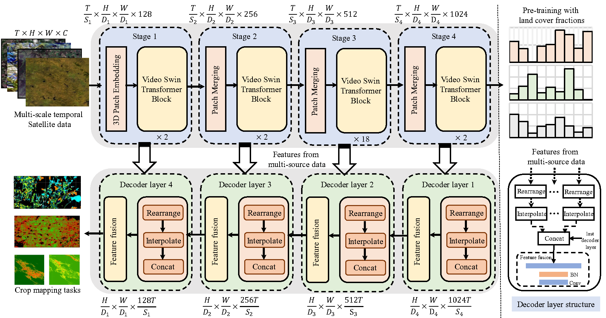

<div align="center">
    <h2>
        AgriFM: A Multi-source Temporal Remote Sensing Foundation Model for Agriculture Mapping
    </h2>
</div>


[](LICENSE)
[](https://arxiv.org/abs/2505.21357)

<div align="center">
    
</div>

## Introduction

This repository is the code implementation of the paper 
[AgriFM: A Multi-source Temporal Remote Sensing Foundation Model for Agriculture Mapping](https://arxiv.org/abs/2505.21357).

AgriFM is a multi-source temporal remote sensing foundation model 
specifically designed for agricultural Agriculture mapping. 
Our approach begins by establishing the necessity of simultaneous 
hierarchical spatiotemporal feature extraction, leading to the 
development of a modified Video Swin Transformer architecture 
where temporal down-sampling is synchronized with spatial down-sampling 
operations. This modified backbone enables efficient unified processing 
of long time-series satellite inputs while preserving critical multi-scale
spatial patterns and phenological dynamics. AgriFM leverages temporally 
rich data streams from three satellite sources including MODIS, Landsat-8/9 
and Sentinel-2, and is pre-trained on a global representative dataset 
comprising over 25 million image samples supervised by land cover products. 
The resulting framework incorporates a versatile decoder architecture 
that dynamically fuses these learned spatiotemporal representations, 
supporting diverse downstream tasks including cropland mapping, 
field-boundary delineation, early-season crop  mapping, and 
specific crop  mapping (e.g., winter wheat and paddy rice) 
with difference data sources. 

## Table of Contents

- [Introduction](#Introduction)
- [Table of Contents](#Table-of-Contents)
- [Installation](#Installation)
- [Dataset Preparation](#Dataset-Preparation)
- [Model Usage](#Model-Training)
- [Citation](#Citation)
- [License](#License)
- [Contact](#Contact)

## Installation

### Dependencies

- Linux or Windows
- Python 3.9+, recommended 3.9.18
- PyTorch 2.0 or higher, recommended 2.1
- CUDA 11.7 or higher, recommended 12.1
- MMCV 2.0 or higher, recommended 2.1.0
 
### Environment Installation

We recommend using Miniconda for installation. The following command will create a virtual environment named `AgriFM` and install PyTorch,GDAL and other libraries.

Note: If you have experience with Conda, pytorch and have already installed them, you can skip to the next section. Otherwise, you can follow these steps to prepare.

<details>


**Step 0**: Install [Miniconda](https://docs.conda.io/projects/miniconda/en/latest/index.html).

Then you can quickly create environment by running the following command in your terminal:

```shell
conda env create -f environment.yml  
```

If it does not work, you can manually install the dependencies by following the steps below.

**Step 1**: Create a virtual environment named `AgriFM` and activate it.


```shell

conda create -n AgriFM python=3.9 -y

[conda] activate AgriFM

```


**Step 2**: Install [PyTorch](https://pytorch.org/get-started/locally/).


```shell

conda install pytorch==2.1.1 torchvision==0.16.1 torchaudio==2.1.1 pytorch-cuda=12.1 -c pytorch -c nvidia

```


**Step 3**: Install [MMCV](https://mmcv.readthedocs.io/en/latest/get_started/installation.html).


```shell

pip install -U openmim

mim install "mmcv==2.1.0"

```


**Step 4**: Install other dependencies.


```shell

pip install ftfy tqdm regex h5py prettytable timm scipy einops numpy==1.26.2

```

</details>

## Dataset Preparation

### Data Download and Example Data
You can download the dataset from [OneDrive](https://hkuhk-my.sharepoint.com/:u:/g/personal/liwayne_hku_hk/ESVBYsFqQB5Nscyox2wMxnUB5LYD1oszKBt-VCh-xGE0tQ?e=UTgfvM) or [GLASS Website](https://glass.hku.hk/casual/AgriFM/). 
The dataset includes example data for quick start, 
formatted as H5 files that follow a unified multi-source remote sensing data structure.

### Dataset Structure

The example dataset is organized as follows:

```
example_dataset/  
├── data_lists/          # Text files listing sample filenames (one per line)  
│   ├── train.txt       # Training set samples (e.g., sample_001, sample_002)  
│   └── val.txt         # Validation set samples
│   └── test.txt         # Validation set samples  
└── h5_samples/         # Directory storing H5 format samples  
    ├── 2018_T31TDK_2560_2304.h5    # Single sample file (contains multi-source data and labels)  
    ├── 2018_T31TDK_2816_0768.h5  
    └── ...  
```

Each H5 file contains multi-source remote sensing data and labels, structured as follows:
```
h5_file.h5  
├── [Source1]  # Customizable data source name (e.g., S2, Landsat, Modis and etc.)  
│   shape: (T, C, H, W)  
│   - T: Number of time steps (T=1 for single-temporal data)  
│   - C: Number of bands  
│   - H/W: Image height/width  
├── [Source2]  # Customizable data source name (e.g., S2, Landsat, Modis and etc.) 
└── label        # Mandatory label  
    shape: (H, W)  
    - Type: Integer (pixel-level classification labels)  
```

For example, a Sentinel-2 sample with 10 bands and 256x256 pixles is provided. 
It can be loaded and processing using our provided dataset [MappingDataset](AgriFM/datasets/mapping_dataset.py) class, 
which handles multi-source data and labels.


### Custom Dataset Preparation
If you want to use your own dataset, you can implement a custom dataset class by inheriting from the `MappingDataset` class.
You need to ensure that the outputs of the dataset class follow the same structure as the example dataset:
1. A dictionary containing multi-source data (each value is a tensor of shape [T, C, H, W])
2. A label tensor

```
# Output example  
{  
    "data": {  
        "source1": torch.Tensor(T, C, H, W),  # Multi-source data dictionary  
        "source2": torch.Tensor(T, C, H, W)  
    },  
    "label": torch.LongTensor(H, W),        # Label (long integer type)  
    "file_name": str                        # Optional: Sample filename for debugging  
}  
```

**Notes: source names in the data dictionary should be consistent with the names used in the model configuration.**

## Model Training

The pretrained AgriFM weights can be downloaded from [OneDrive](https://hkuhk-my.sharepoint.com/:u:/g/personal/liwayne_hku_hk/IQBmnMhsLRy6QabkuxMmJi8lAZigBqnMkaQuefCLR_AGzt4?e=MyKeCK) or [GLASS Website](https://glass.hku.hk/casual/AgriFM/).

### Model Architecture
The AgriFM model consists of three main components:

1. **Multi-modal Encoder**: Processes different remote sensing data sources
2. **Fusion Neck**: Combines features from different modalities
3. **Prediction Head**: Generates final crop classification maps

#### Configuration Details
The model configuration is defined as follows (in [cropland_config](configs/cropland_mapping.py)).


### Key Parameters Explanation

#### Encoder Configuration
| Parameter | Description | Example Value |
|-----------|-------------|---------------|
| `patch_size` | Spatiotemporal patch size | (4,2,2) |
| `in_chans` | Input channels per timestep | 10 (for Sentinel-2) |
| `depths` | Number of transformer blocks per stage | [2, 2, 18, 2] |
| `num_heads` | Attention heads per stage | [4, 8, 16, 32] |
| `window_size` | Local attention window size | (8,7,7) |

#### Fusion Neck Configuration
| Parameter | Description | Example Value |
|-----------|-------------|---------------|
| `embed_dim` | Feature dimension | 1024 |
| `in_feature_key` | Input modality keys | ('S2',) |
| `feature_size` | Input feature map size | (img_size//16, img_size//16) |
| `out_size` | Output map size | (img_size, img_size) |

#### Head Configuration
| Parameter | Description | Example Value |
|-----------|-------------|---------------|
| `num_classes` | Number of crop classes | Varies by dataset |
| `loss_model` | Loss function type | "CropCEloss" |

### Training Command
To train the model using the provided configuration:

```shell
python train.py configs/cropland_mapping.py --work_dir ./work_dirs/cropland_mapping
```
This command will start training the model with the specified configuration file and save the results in the `work_dirs/cropland_mapping` directory.

### Training Tips
1. The default configuration uses Sentinel-2 data ('S2' key) - add additional encoders for other data sources

### Test and Validation
To evaluate the model, you can use the following command:

```shell
python test.py configs/cropland_mapping.py work_dirs/cropland_mapping/best_mFscores_xx.pth
```

To get the visualization results, you can use the following command:

```shell
python inference.py configs/cropland_mapping.py work_dirs/cropland_mapping/best_mFscores_xx.pth path/to/your/visualization_output
```


## Citation

If you use the code or performance benchmarks of this project in your research, please refer to the bibtex below to cite.

```
@article{li2026agrifm,
  title={AgriFM: A multi-source temporal remote sensing foundation model for Agriculture mapping},
  author={Li, Wenyuan and Liang, Shunlin and Chen, Keyan and Chen, Yongzhe and Ma, Han and Xu, Jianglei and Ma, Yichuan and Zhang, Yuxiang and Guan, Shikang and Fang, Husheng and others},
  journal={Remote Sensing of Environment},
  volume={334},
  pages={115234},
  year={2026},
  publisher={Elsevier}
}
```

## License

This project is licensed under the [Apache 2.0 license](LICENSE).

## Acknowledgements
This project is built upon [OpenMMLab](https://openmmlab.com/). We thank the OpenMMLab developers.

Our model is built upon [Video Swin Transformer](https://github.com/SwinTransformer/Video-Swin-Transformer).

## Contact

If you have any other questions or suggestions, please contact Wenyuan Li ([liwayne@hku.hk](mailto:liwayne@hku.hk)).

